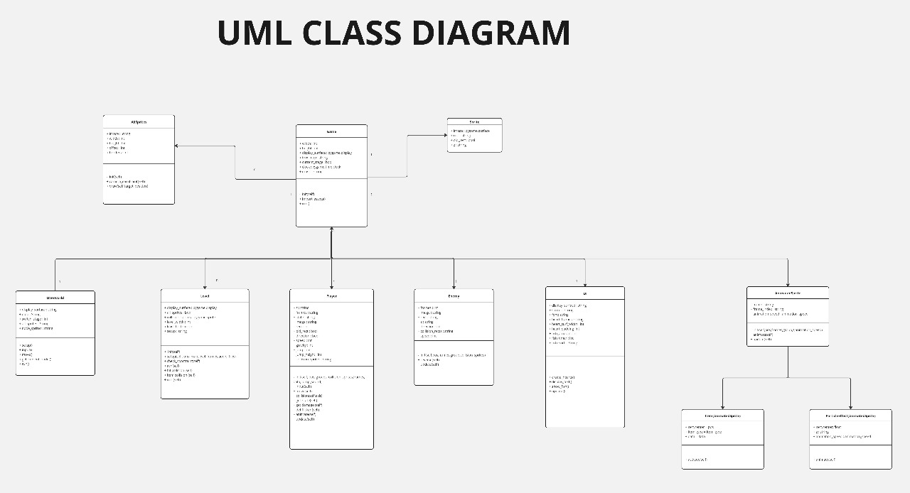

# THE ADVENTURE OF GOZY CAT
## Created by GitBros
_______________

## GitHub Link
[Klik di sini](https://github.com/mustafamadjid/TugasBesar-Kelompok5-Platformer.git)
 
## Anggota GitBros
| Nama                    | NIM       | Contributions  | 
|-------------------------|-----------|----------------|
| Athaullah Mustafa Madjid| 122140191 | Lead Programmer| 
| Arya Pratama            | 122140156 | Programmer     | 
| Aditya Wahyu Suhendar   | 122140235 | Programmer     | 
| Eden Wijaya             | 122140187 | Designer       | 
| M. Fatih Hanbali        | 122140122 | Designer       | 
| Debora Sihombing        | 122140032 | Designer       | 

## Deskripsi Permainan
Dalam permainan ini, pemain akan mengendalikan karakter bernama Gozy. Gozy adalah kucing yang tersesat di hutan berbahaya. Pemain harus menghindari beberapa monster jahat dan rintangan berbahaya hingga Gozy kembali ke rumah majikannya.

## Cara Bermain
Pemain dapat mengontrol Gozy Cat dengan menggunakan tombol 'W (Lompat), A (Kiri), D (Kanan)' pada keyboard. Tombol-tombol tersebut akan menggerakkan Gozy sesuai arahan untuk melewati setiap rintangan berupa Obstacle atau Monster. Health pada karakter Gozy hanya terdapat 3 heart. Jika pemain mengenai monster atau obstacle, health akan berkurang satu heart. Jika health habis, pemain kalah (Game Over). Pemain bisa menang jika berhasil mencapai Finish di rumah.

## Identifikasi Kelas
- Player
- Level
- Sprites
- Game
- Animatedsprite
- Enemy
- Allsprite
- ui
- Timer
- Data
- Overworld

## UML Class Diagram

## Objek

- **Gozy Cat**: Gozy Cat adalah objek utama dalam game yang dikendalikan oleh pemain.
- **Score Board**: Objek yang menampilkan skor yang didapatkan oleh pemain dari mendapatkan Snack Cat.
- **Background**: Objek yang merupakan latar game bertema hutan dengan pohon-pohon dan air terjun.
- **Cat Snack**: Objek yang ketika didapatkan akan menambahkan skor sebanyak 2 poin.
- **Obstacles**: Objek yang merupakan rintangan bagi Gozy Cat selain monster, seperti duri-duri.
- **Monster**: Objek berbentuk monster yang merupakan musuh-musuh penghambat Gozy Cat.

## License
GitBros

**Thank you**
