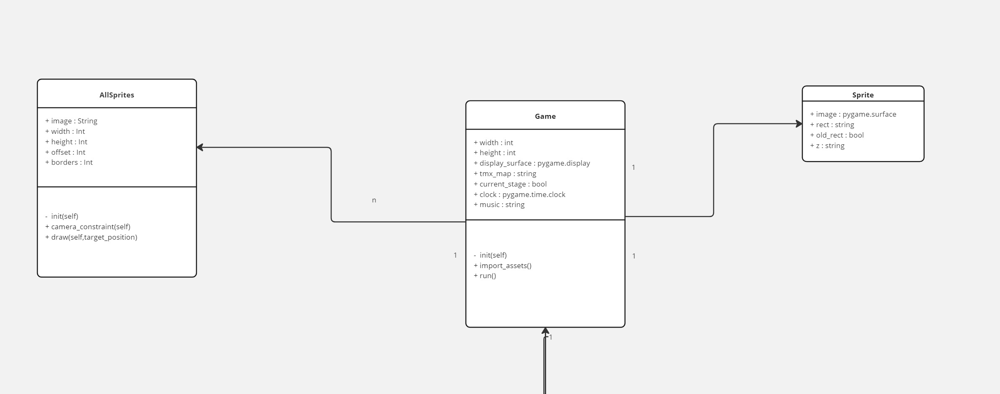

# THE ADVENTURE OF GOZY CAT

## Created by GitBros

---

## GitHub Link

[Klik di sini](https://github.com/mustafamadjid/TugasBesar-Kelompok5-Platformer.git)

## YouTube Link

[Klik di sini](https://youtu.be/iwCpQ-dPmp8?feature=shared)

## Anggota GitBros

| Nama                     | NIM       | Contributions      |
| ------------------------ | --------- | ------------------ |
| Athaullah Mustafa Madjid | 122140191 | Programmer    |
| Arya Pratama             | 122140156 | Programmer         |
| Aditya Wahyu Suhendar    | 122140235 | Programmer         |
| Eden Wijaya              | 122140187 | Character Designer |
| M. Fatih Hanbali         | 122140122 | Map Designer       |
| Debora Sihombing         | 122140032 | Map Designer       |

## Deskripsi Permainan

Dalam permainan ini, pemain akan mengendalikan karakter bernama Gozy. Gozy adalah kucing yang tersesat di hutan berbahaya. Pemain harus menghindari beberapa monster jahat dan rintangan berbahaya hingga Gozy kembali ke rumah majikannya.

## Cara Bermain

Pemain dapat mengontrol Gozy Cat dengan menggunakan tombol 'W (Lompat), A (Kiri), D (Kanan)' pada keyboard. Tombol-tombol tersebut akan menggerakkan Gozy sesuai arahan untuk melewati setiap rintangan berupa Obstacle atau Monster. Health pada karakter Gozy hanya terdapat 3 heart. Jika pemain mengenai monster atau obstacle, health akan berkurang satu heart. Jika health habis, pemain kalah (Game Over). Pemain bisa menang jika berhasil mencapai Finish di rumah.

## Identifikasi Kelas

- Player
- Level
- Sprites
- Game
- Animatedsprite
- Enemy
- Allsprite
- ui
- Timer
- Data
- Overworld

## UML Class Diagram

## Penerapan PBO

### 1. Pewarisan

Konsep Pewarisan diterapkan pada pewarisan kelas Sprite yang berasal dari modul pygame seperti yang terjadi pada kelas Player dan Sprites

### 2. Enkapsulasi

Enkapsulasi diterapkan pada kelas item dan Game, dimana setiap atributnya memiliki visbility modifier berupa protected

### 3. Polimorfisme

Polimorfisme terdapat pada method move(), dimana move() pada player berbeda dengan move() pada enemy tetapi memiliki penamaan method yang sama, Sama seperti yang ada method run(),update(),animate() pada kelas-kelas lain

### 4. Abstraksi

Abstraksi diterapkan pada kelas Game, dimana kelas Game memiliki 3 atribut dan 2 abstract method berupa method run() dan import_assets(), yang mana setiap atribut dan methodnya digunakan pada kelas pewaris yakni GozyGame

## Objek

### - **Gozy Cat**:

Gozy Cat adalah objek utama dalam game yang dikendalikan oleh pemain.

### - **Score Board**:

Objek yang menampilkan skor yang didapatkan oleh pemain dari mendapatkan Snack Cat.

### - **Background**:

Objek yang merupakan latar game bertema hutan dengan pohon-pohon dan air terjun.

### - **Cat Snack**:

Objek yang ketika didapatkan akan menambahkan skor sebanyak 2 poin.

### - **Obstacles**:

Objek yang merupakan rintangan bagi Gozy Cat selain monster, seperti duri-duri.

### - **Monster**:

Objek berbentuk monster yang merupakan musuh-musuh penghambat Gozy Cat.

## License

GitBros

**Thank you**
